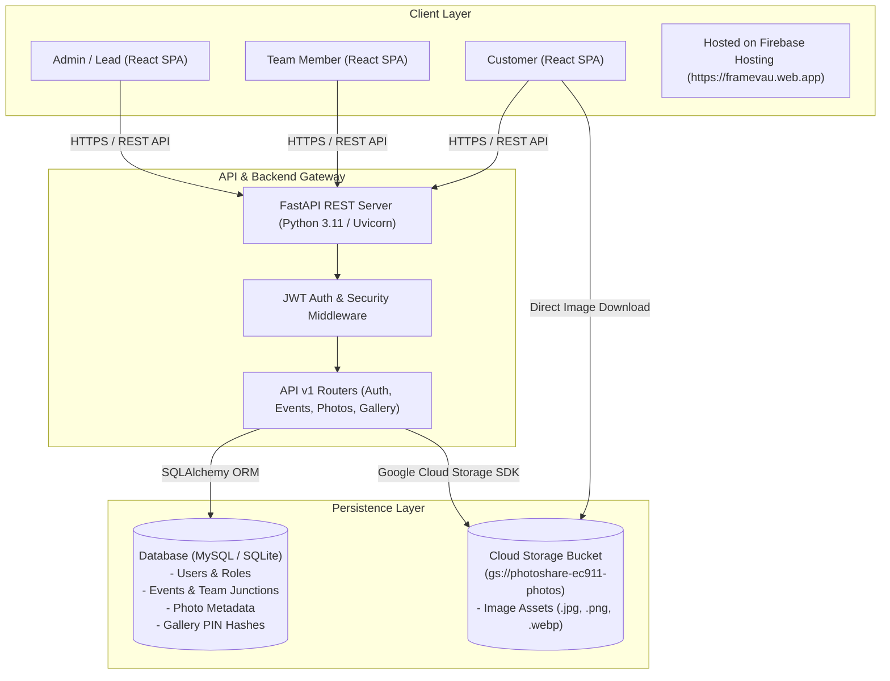
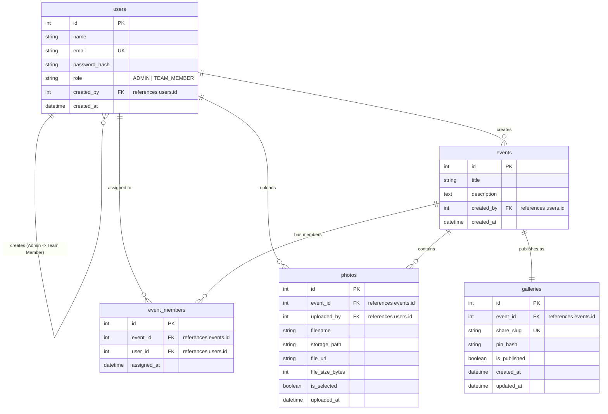

# TrizenAI Full-Stack Photo Sharing Platform (FrameVault)

A full-stack, role-based photo sharing and event management platform built for **TrizenAI Technologies**.

---

## 🌟 Key Features & Workflows

1. **Role-Based Authentication (JWT)**:
   - **Admin / Lead**: Full event management, team member assignments, photo curation/selection (`is_selected`), and publishing PIN-protected galleries.
   - **Team Member**: View assigned events, multi-photo drag-and-drop uploads, and view personal uploaded assets.
   - **Customer**: Access published galleries using a shareable link and a secure 6-digit access PIN without creating an account.

2. **Photo Storage & Database Architecture**:
   - **Database**: MySQL (`trizen_photo_share`) storing user credentials, events, team member junctions, photo metadata, and hashed gallery access PINs.
   - **Storage Layer**: Firebase Storage SDK integration with automatic local disk storage fallback (`backend/uploads/`). Image binary files are never stored directly in MySQL.

---

## 🏗️ System Architecture Diagram



---

## 📊 Database Entity-Relationship (ER) Diagram



---

## 📁 Repository Directory Structure

```
trizen-photo-share/
├── backend/
│   ├── app/
│   │   ├── api/
│   │   │   └── v1/
│   │   │       ├── endpoints/
│   │   │       │   ├── auth.py          # Login, Register, Team listing
│   │   │       │   ├── events.py        # Event CRUD & Team assignments
│   │   │       │   ├── photos.py        # Multi-photo upload & selection
│   │   │       │   └── gallery.py       # Publish gallery & PIN verification
│   │   │       └── api.py               # API v1 Router aggregator
│   │   ├── core/
│   │   │   ├── config.py                # App settings (Pydantic v2)
│   │   │   ├── security.py              # Password & PIN hashing, JWT encoding
│   │   │   └── firebase.py              # Firebase Storage & Fallback
│   │   ├── db/
│   │   │   ├── base.py                  # SQLAlchemy Declarative Base
│   │   │   └── session.py               # DB Session maker
│   │   ├── models/                      # SQLAlchemy Data Models
│   │   ├── schemas/                     # Pydantic Request/Response Schemas
│   │   └── main.py                      # FastAPI Application entrypoint
│   ├── uploads/                         # Local storage fallback directory
│   ├── requirements.txt                 # Backend Python package list
│   └── .env.example                     # Environment template
├── frontend/
│   ├── src/
│   │   ├── components/                  # Navbar, PhotoGrid, PhotoUploader, PublishModal
│   │   ├── pages/                       # Login, AdminDashboard, TeamDashboard, PublicGallery
│   │   ├── services/                    # Axios clients & API handlers
│   │   ├── App.jsx                      # React Router routes
│   │   └── main.jsx                     # Vite mount point
│   ├── package.json                     # Frontend dependencies
│   ├── vite.config.js                   # Vite dev server configuration
│   └── tailwind.config.js               # Styling configuration
└── README.md
```

---

## 🚀 Local Development Setup Guide

### 1. Database Setup (MySQL)
Create the MySQL database:
```sql
CREATE DATABASE trizen_photo_share;
```

### 2. Backend Setup (FastAPI)
Navigate to the `backend/` directory and configure Python 3.11+:

```bash
cd backend
python -m venv venv
# On Windows:
venv\Scripts\activate
# On Linux/macOS:
source venv/bin/activate

pip install -r requirements.txt
```

Create `.env` file inside `backend/`:
```env
PROJECT_NAME="TrizenAI Photo Sharing Platform"
API_V1_STR="/api/v1"
SECRET_KEY="trizen_super_secret_jwt_key_2026"
ALGORITHM="HS256"
ACCESS_TOKEN_EXPIRE_MINUTES=1440

DB_HOST="localhost"
DB_PORT=3306
DB_USER="root"
DB_PASSWORD=""
DB_NAME="trizen_photo_share"
```

Start the FastAPI Backend server:
```bash
uvicorn app.main:app --reload --port 8000
```
Interactive API docs available at: `http://localhost:8000/docs`

---

### 3. Frontend Setup (React / Vite)
Navigate to the `frontend/` directory:

```bash
cd frontend
npm install
npm run dev
```
Open browser at: `http://localhost:5173`

---

## 🔒 User Roles & Operational Workflow Sequence

1. **Admin Registration**:
   - Register the initial user at `/login` with Role: **Admin / Lead**.
   - Admin creates an Event (e.g. *Arjun & Priya Wedding*).
2. **Team Allocation & Photo Upload**:
   - Admin creates Team Member user accounts and assigns them to the Event.
   - Team Members login at `/login`, navigate to `/team`, select assigned event, and drag-and-drop multi-photo uploads.
3. **Photo Selection & Publishing**:
   - Admin views uploaded photos in `/admin`, reviews photos, and checks selected photos (`is_selected`).
   - Admin clicks **Publish Gallery**, sets a 6-digit access PIN (e.g. `482917`), and generates shareable link (`/gallery/:share_slug`).
4. **Customer Access**:
   - Customer opens `/gallery/:share_slug`, enters 6-digit PIN `482917`.
   - Backend verifies PIN hash, and renders selected photos in high-resolution masonry view with lightbox download options.
